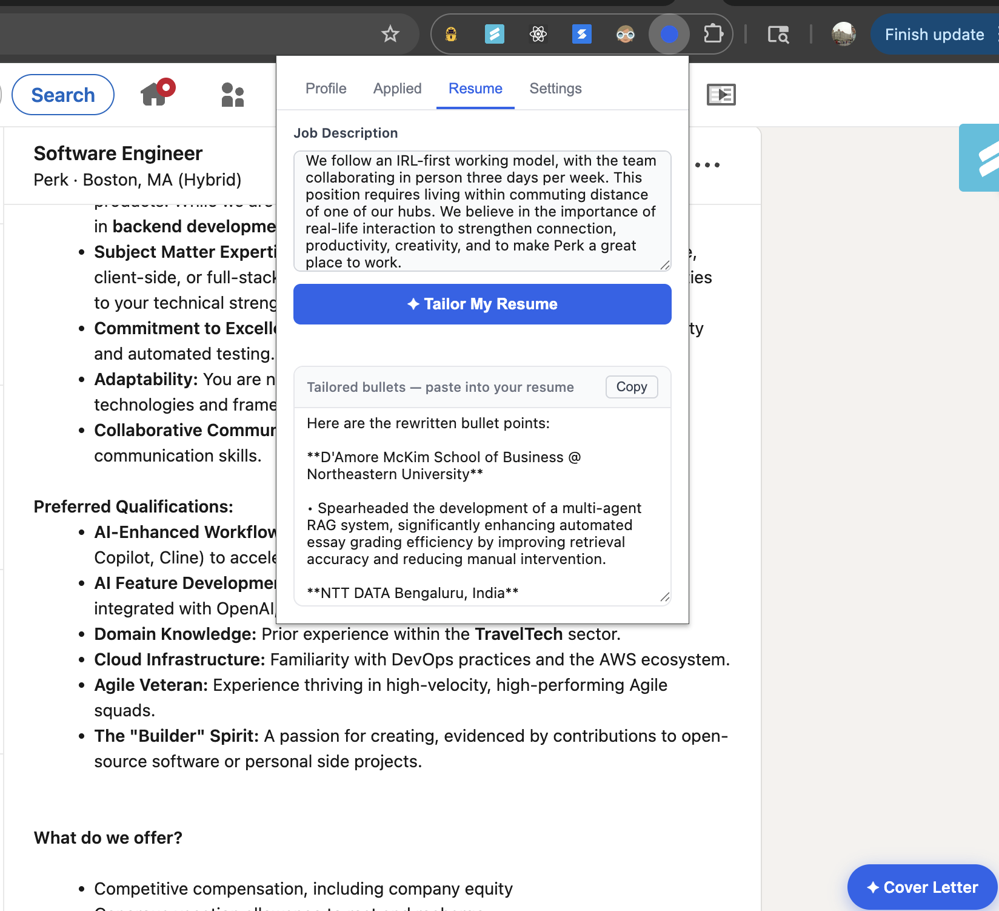

# ezApply

A Chrome extension that automates the painful parts of job applications — AI cover letters, auto-fill, resume tailoring, and application tracking. Runs entirely locally. Works with any AI provider.



---

## Features

- **✦ AI Cover Letters** — generates a tailored cover letter for each job, with tone control (Professional, Conversational, Confident, Concise)
- **⚡ Auto-fill** — fills application forms instantly from your saved profile
- **✦ Resume Tailoring** — rewrites your resume bullets to match a job description
- **✦ Custom Question Answering** — AI answers open-ended application questions inline
- **📊 Application Tracker** — logs every application with a status pipeline (Applied → Phone Screen → Interview → Offer / Rejected)
- **🔒 Fully local** — no server, no account, no data leaving your machine

Works on LinkedIn Easy Apply, Indeed, JobRight, Greenhouse, Lever, Workday, and most standard application forms.

---

## Supported AI Providers

| Provider | Notes |
|---|---|
| Anthropic (Claude) | Recommended — fast and accurate |
| OpenAI (GPT) | Works great |
| Groq | Free tier available, very fast |
| Ollama | Fully offline, no API key needed |
| Custom | Any OpenAI-compatible endpoint |

---

## Install (Developer Mode)

Until the Chrome Web Store listing is live, install manually — takes under a minute.

**1. Download**

Click **Code → Download ZIP** on this page, then unzip it.

**2. Open Chrome Extensions**

Go to `chrome://extensions` in your browser.

**3. Enable Developer Mode**

Toggle **Developer mode** on (top right corner).

**4. Load the extension**

Click **Load unpacked** → select the `ezApply` folder (the one that contains `manifest.json`).

That's it. The ezApply icon will appear in your toolbar.

---

## Setup

**1. Fill your profile**

Click the ezApply icon → **Profile** tab. Fill in your details and paste your resume text. This is used to auto-fill forms and generate cover letters. Save once, reuse everywhere.

**2. Add your AI provider**

Go to **Settings** tab. Pick your provider, paste your API key, and set the model. For Ollama, no API key is needed — just make sure Ollama is running locally.

> **Ollama users:** Ollama needs to allow requests from the extension. Run this once, then restart Ollama:
> ```bash
> launchctl setenv OLLAMA_ORIGINS "chrome-extension://*"
> ```

**3. Go apply**

Visit any job listing. You'll see two buttons in the bottom-right corner:

- **✦ Cover Letter** — opens a modal to generate and insert a cover letter
- **⚡ Fill Fields** — auto-fills all form fields from your profile

On application forms, a small **✦ AI Answer** button appears below each open-ended question.

---

## Usage

### Cover Letter
1. Open a job listing
2. Click **✦ Cover Letter**
3. Pick a tone — Professional, Conversational, Confident, or Concise
4. Edit if needed → **Insert into page** or **Copy**

### Auto-fill
1. Open an application form
2. Click **⚡ Fill Fields**
3. Review and submit

### Resume Tailoring
1. Open the ezApply popup → **Resume** tab
2. Paste the job description
3. Click **✦ Tailor My Resume**
4. Copy the rewritten bullets into your resume doc

### Application Tracker
Every time you auto-fill or insert a cover letter, the application is logged automatically. Update the status as you progress through interviews.

---

## Privacy

- All data (profile, settings, applications) is stored in your browser using IndexedDB and `chrome.storage.local`
- API keys are stored locally and only ever sent to your chosen AI provider
- No analytics, no tracking, no external servers

---

## Contributing

PRs welcome. To run locally, just load the unpacked extension as described above — no build step needed.

---

## License

MIT
